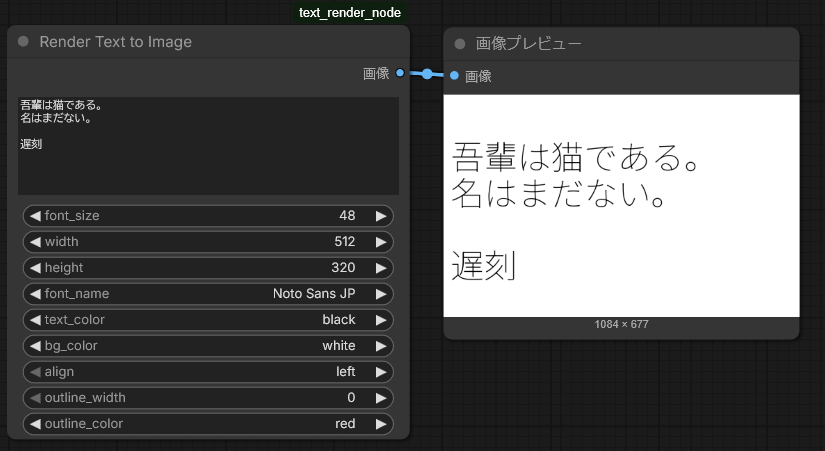

# ComfyUI Text Renderer
Text render node for ComfyUI



fonttools required if you want to show font names instead of font file name.

```
python_embeded\python -m pip install fonttools
```

See this blog for details(In Japanese).  
https://nowokay.hatenablog.com/entry/2026/01/05/110344
